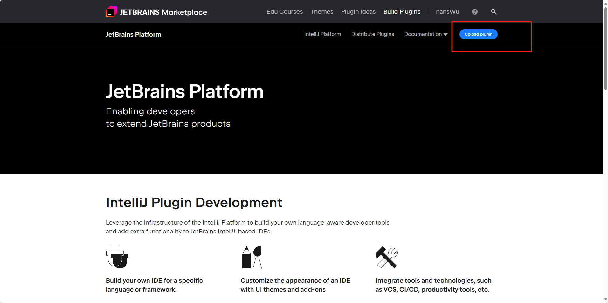

# 打包说明
## [gradle.properties](gradle.properties)
1. pluginVersion 为插件版本
2. pluginSinceBuild与pluginUntilBuild 参考 https://plugins.jetbrains.com/docs/intellij/build-number-ranges.html#build-number-format
3. platformVersion 参考 https://plugins.jetbrains.com/docs/intellij/tools-gradle-intellij-plugin.html#configuration-intellij-extension

大部分情况下如果只做版本兼容修改pluginUntilBuild即可
打包后打包的文件会保存在项目的build/distributions下(记得修改更新日志[CHANGELOG.md](CHANGELOG.md))

# 发布说明
https://plugins.jetbrains.com/developers 进入IDE官网开发者网页并登录点击上传插件

